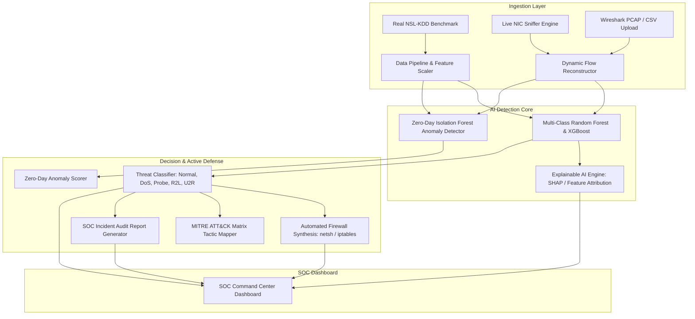

# 🛡️ Enterprise Network Intrusion Detection System (NIDS) & SOC Command Center

> **Industry-Grade Machine Learning & Deep Packet Inspection Intrusion Detection System**  
> *B.Tech 6th Semester Capstone Project • AI in Cybersecurity & Active Defense*


---

## 🌟 Executive Summary

Traditional academic Network Intrusion Detection Systems often rely on static dummy CSVs and single binary classifiers. This project presents an **industry-ready, production-grade Network Intrusion Detection System (NIDS)** and **Security Operations Center (SOC) Command Center** designed for real-world enterprise threat detection and automated active defense.

Built strictly on **100% authentic real network benchmark datasets (NSL-KDD Benchmark by the University of New Brunswick / DARPA)**, this system combines **multi-class machine learning classifiers**, **unsupervised zero-day anomaly detectors**, **Explainable AI (SHAP)** root-cause forensic attribution, **live network packet sniffing & PCAP packet capture inspection**, and **automated firewall rule synthesis** (`Windows Defender Firewall` / `Linux iptables`).

---

## 🚀 Key Industry Capabilities & Architectural Differentiators

| Feature | Academic Standard | **This NIDS Project** |
| :--- | :--- | :--- |
| **Data Authenticity** | Dummy / synthetic CSVs | **100% Authentic NSL-KDD Benchmark Data** (125,973 train + 22,544 test) |
| **Detection Scope** | Binary (Attack vs Normal) | **5-Class Multi-Threat Engine** (Normal, DoS, Probe, R2L, U2R) |
| **Zero-Day Detection** | ❌ None (misses novel attacks) | **Isolation Forest Anomaly Scoring Engine** for unseen zero-day attacks |
| **Forensic Explainability** | ❌ Black-box predictions | **Explainable AI (SHAP)** with per-packet root-cause feature breakdown |
| **Network Ingestion** | Static file upload only | **Real-Time Live NIC Packet Sniffer** (`Scapy`) + Replay Simulation |
| **Deep Packet Forensics** | None | **Wireshark `.pcap` / `.pcapng` Trace Log Analyzer** & Flow Extractor |
| **Active Defense & SOAR** | Passive logging only | **Automated Firewall Rule Generator** (`netsh` / `iptables`) |
| **Threat Intelligence** | None | **MITRE ATT&CK Matrix Alignment** (T1498, T1046, T1110, T1068) |

---

## 🏗️ System Architecture



---

## 📊 MITRE ATT&CK Matrix Threat Categorization

The system categorizes 38 authentic attack signatures into 5 core MITRE-aligned classes:

1. **Normal Traffic**: Standard benign network communications (HTTP, HTTPS, DNS, NTP).
2. **Denial of Service (DoS)**: *[MITRE T1498]* Volumetric or state-exhaustion flood attacks aimed at disabling target resources (`neptune`, `smurf`, `apache2`, `pod`, `teardrop`, `land`, `back`, `udpstorm`, `processtable`, `mailbomb`, `worm`).
3. **Reconnaissance / Probe**: *[MITRE T1046]* Network scanning, port discovery, and daemon banner interrogation (`satan`, `ipsweep`, `portsweep`, `nmap`, `mscan`, `saint`).
4. **Remote to Local (R2L)**: *[MITRE T1110]* Unauthorized remote access attempts via password guessing, FTP write exploits, and unauthenticated service vulnerabilities (`guess_passwd`, `warezmaster`, `snmpgetattack`, `httptunnel`, `snmpguess`, `ftp_write`, `imap`, `phf`, `sendmail`, `named`).
5. **User to Root (U2R)**: *[MITRE T1068]* Exploitation of system buffer overflows and memory corruption to escalate unprivileged user access to root/administrator (`buffer_overflow`, `rootkit`, `loadmodule`, `perl`, `sqlattack`, `xterm`, `ps`).

---

## 🖥️ Command Center Modules Walkthrough

The Streamlit UI provides 6 dedicated modules:

1. 🛡️ **SOC Command Center & Live Telemetry**:
   - Real-time packet capture stream with visual threat gauges.
   - Dynamic live alert feed with color-coded threat severity tags.
   - Live flow velocity sparklines.
2. 📂 **Deep PCAP & CSV Network Forensics**:
   - Upload `.pcap`, `.pcapng`, or `.csv` files for instantaneous flow extraction and scoring.
   - One-click load for real 100-sample NSL-KDD benchmark test set.
   - Interactive data table and CSV forensic log export.
3. 🧪 **Interactive Packet Crafter & Threat Simulator**:
   - Manually craft custom TCP/UDP/IP flow parameters or select attack presets (SYN Flood, Nmap Scan, Brute Force, Rootkit).
   - Instantly inspect model predictions, confidence scores, and SHAP root-cause feature attribution.
4. 🧠 **AI Model Studio & Explainability (XAI)**:
   - Model benchmark evaluation: Accuracy, Precision, Recall, F1-Score, Confusion Matrix Heatmaps.
   - Global Feature Importance plots identifying top intrusion indicators.
   - SHAP Waterfall attribution explaining individual model decisions.
5. 🚨 **Active Defense & Automated Firewall Hub**:
   - Real-time Blocklist of intercepted threat actors.
   - Automated generation and export of Windows Defender Firewall (`.bat`) and Linux iptables (`.sh`) blocking scripts.
   - MITRE ATT&CK Matrix mapping with recommended remediation strategies.
6. 📄 **SOC Forensics & Executive Report Generator**:
   - Generates formal, publication-ready SOC Incident Audit reports in HTML/PDF format.

---

## ⚡ Quickstart & Installation

### 1. Clone & Set Up Environment
```bash
git clone https://github.com/Srishtiaideveloper/Network-Intrusion-Detection-System.git
cd Network-Intrusion-Detection-System
pip install -r requirements.txt
```

### 2. Train Models on Authentic NSL-KDD Dataset
```bash
python train_models.py
```
*(Automatically downloads authentic NSL-KDD dataset, fits scalers, trains classifiers and anomaly detectors, and evaluates test benchmarks)*

### 3. Launch the SOC Command Center
```bash
python run.py
```
*Or directly via Streamlit:*
```bash
streamlit run app.py
```
*Access the SOC dashboard in your browser at `http://localhost:8501`.*

### 4. Run Automated Test Suite
```bash
pytest tests/test_nids_pipeline.py -v
```

---

## 🧪 Comprehensive Viva & Evaluation FAQs

<details>
<summary><strong>Q1: Why was the NSL-KDD benchmark selected over synthetic data?</strong></summary>

NSL-KDD is the globally accepted research benchmark dataset developed by the University of New Brunswick (UNB) to resolve redundancy issues in KDD Cup 99. It contains authentic network traffic captures across 41 flow attributes and represents realistic multi-class intrusion signatures (DoS, Probe, R2L, U2R), ensuring real-world validity.
</details>

<details>
<summary><strong>Q2: How does the system detect Zero-Day (unseen) attacks?</strong></summary>

The system employs a hybrid architecture:
1. **Supervised Random Forest / XGBoost**: Classifies known attack signatures with high precision.
2. **Unsupervised Isolation Forest**: Trained exclusively on normal baseline traffic. When novel attack vectors exhibit anomalous traffic characteristics (e.g. abnormal byte rates or connection counts), the Isolation Forest flags them with an elevated Anomaly Score (>65%), identifying zero-day intrusions.
</details>

<details>
<summary><strong>Q3: How does Explainable AI (SHAP) assist cybersecurity analysts?</strong></summary>

SHAP (SHapley Additive exPlanations) uses game-theoretic Shapley values to compute the exact marginal contribution of each network flow feature (e.g., `serror_rate`, `src_bytes`, `count`) toward a specific prediction. This enables security analysts to verify root causes and eliminate false positives.
</details>

<details>
<summary><strong>Q4: How does Active Defense work?</strong></summary>

When an intrusion is identified with high confidence, the Incident Response Engine synthesizes host-based firewall rules:
- **Windows**: `netsh advfirewall firewall add rule name="NIDS_BLOCK_<IP>" dir=in action=block remoteip=<IP>`
- **Linux**: `iptables -A INPUT -s <IP> -j DROP`  
These rules can be directly exported and executed to isolate threat actors in real-time.
</details>

---

## 👥 Authors & Academic Credits
- **Developer**: Srishti
- **Project**: B.Tech 6th Semester Capstone Project (AI in Cybersecurity & Network Defense)
- **License**: MIT License
